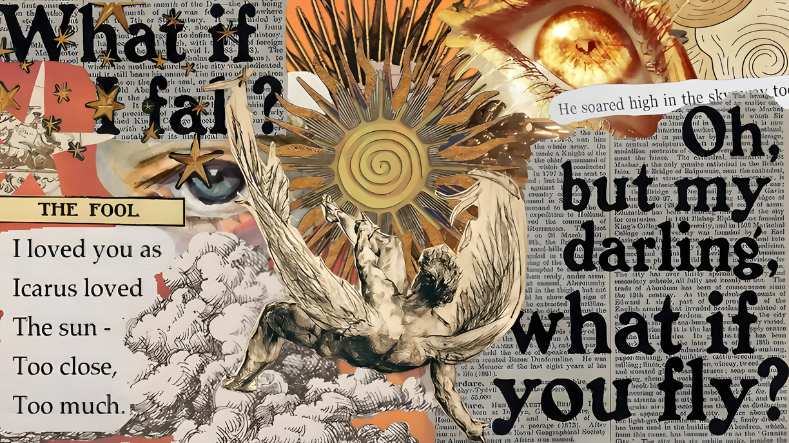
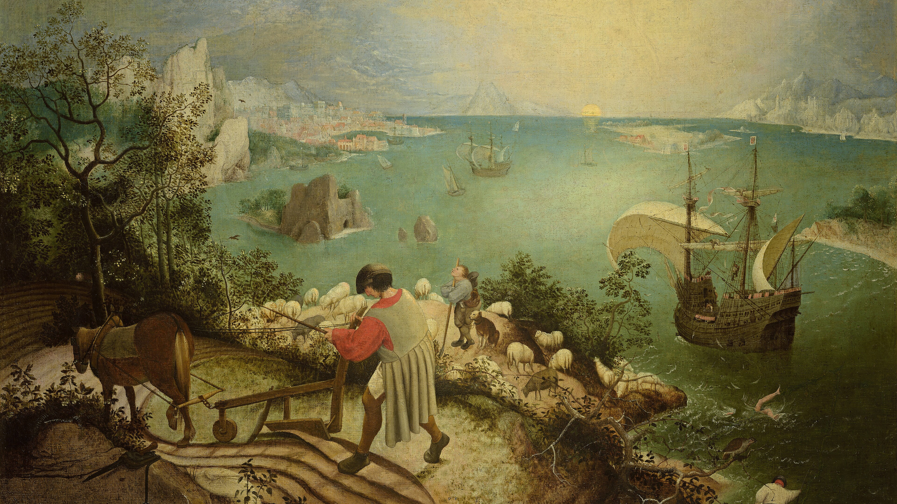
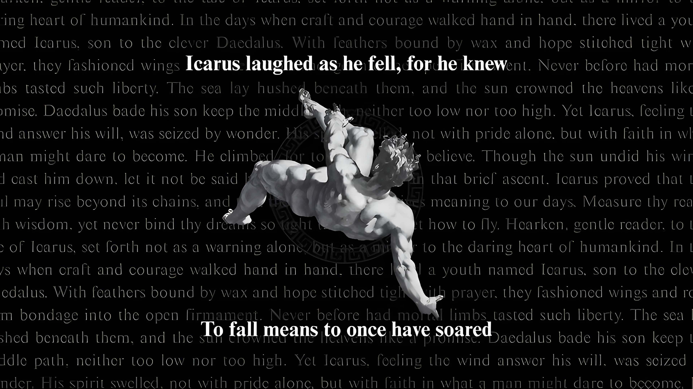
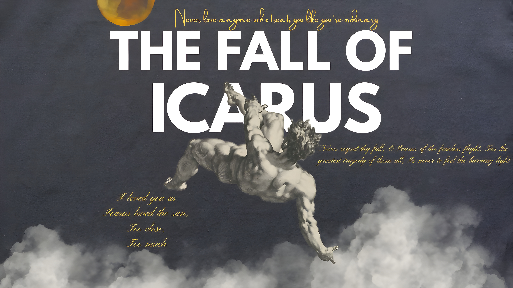
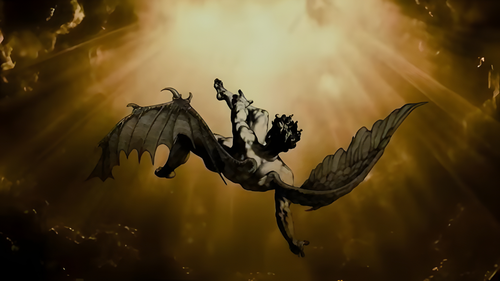
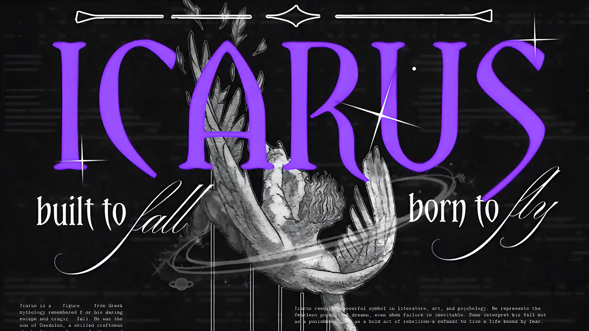
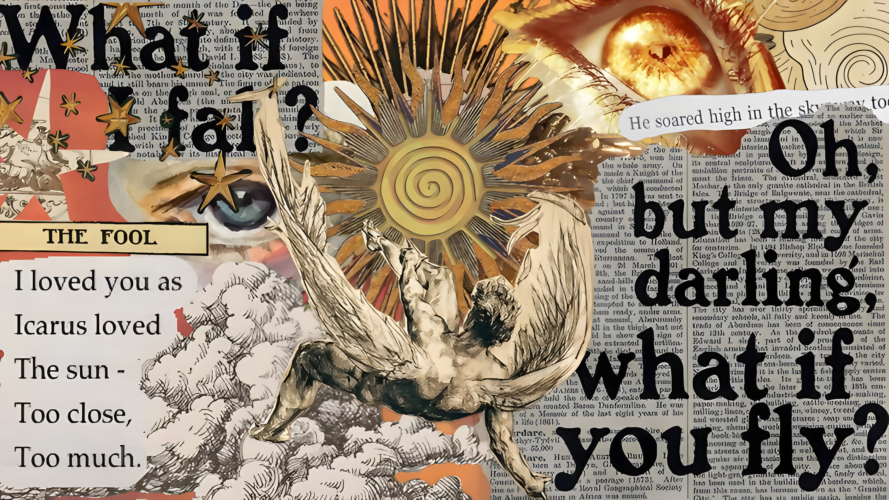
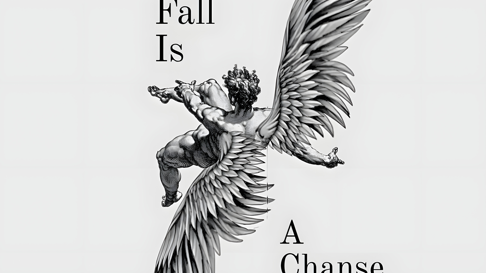
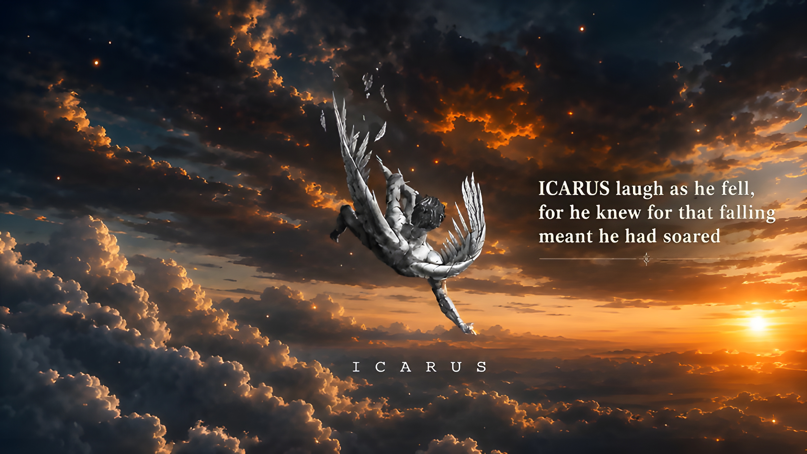

# Icarus

A molten, golden sun against a deep dusk. A theme born from the Icarus legend — wired, vivid, and flying a little too close to the light: warm amber and gold accents, ember reds, set on a navy-purple night ground.

> This project is ~99% vibed coded.



## Install

```bash
omarchy theme install https://github.com/OlgerZG/omarchy-icarus-theme.git
```

The repo is named `omarchy-icarus-theme`; when installed it shows up in the theme picker as **Icarus**. Installation applies it automatically.

Or use *Install > Style > Theme* in the Omarchy menu, then pick **Icarus** under *Style > Theme* (`Super + Ctrl + Shift + Space`).

Requires Omarchy 4. The palette uses the semantic key set, which does not exist in 2.x.

## Palette

The theme ships a single hand-written `colors.toml`. Omarchy generates everything else — terminals (Alacritty, Foot, Ghostty, Kitty), Hyprland window borders, Hyprlock, the shell bar, btop, Chromium, Neovim, VS Code, Mako, SwayOSD, Walker, Helix, and the screen-share picker — from `$OMARCHY_PATH/default/themed/*.tpl` at theme set time.

Key | Value
----|------
`accent` | `#f2b138`
`selection` | `#3b3448`
`muted` | `#8a7f6b`
`background` | `#1a1626`
`lighter_background` | `#27203a`
`foreground` | `#e9e0cd`
`bright_foreground` | `#f8f1e0`
`orange` | `#f2994a`
`gold`/`yellow` | `#f2d36b`
`blue` | `#7ba3d6`
`magenta` | `#c98fd0`

## What it ships

`colors.toml`, `icons.theme` (Yaru-orange), `preview.png`, and `backgrounds/`. Nothing in this repository runs on your machine: no `neovim.lua`, no terminal config, no `vscode.json`, no `shell.toml`. This is deliberate — leaving those out is what makes the entire desktop fall out of the palette and keeps the theme picking up shell improvements on each Omarchy release instead of pinning a snapshot.

## The scaling process

Every wallpaper in `backgrounds/` was converted to **4K (3840×2160), 16:9** using AI upscaling:

1. **Center-crop to 16:9** — each source was cropped to a 16:9 aspect ratio with `magick -auto-orient -gravity center -crop 16:9 +repage`, keeping the visual center of the image.
2. **Deblock small JPEGs** — sources smaller than 1600px wide (most of them) had their 8×8 DCT block artifacts smoothed with a `-despeckle` pass before upscaling, so blocky JPEG "squares" are not amplified.
3. **AI upscale with Real-ESRGAN** — crops were super-resolved on the GPU using [Real-ESRGAN](https://github.com/xinntao/Real-ESRGAN) (`realesrgan-x4plus` model, ncnn/Vulkan build) at the smallest factor that reaches 4K:
   - `-s 4` for sources up to ~960px wide
   - `-s 3` for ~960–1280px
   - `-s 2` for ~1280–1920px
   - straight resize for already-4K sources
   The whole image was processed as a **single tile** (no tiling grid), so no seams or misaligned squares are introduced.
4. **Final fit to 3840×2160** — the upscaled result was resized to exactly 4K 16:9 with a light `-unsharp 0x1+0.6+0.05` sharpen and saved as quality-95 JPEG.

Run it yourself:

```bash
# Prefer the smallest ESRGAN factor that reaches 4K:
realesrgan-ncnn-vulkan -i crop.png -o up.png -s 4 -n realesrgan-x4plus -m /usr/share/realesrgan-ncnn-vulkan/models
magick up.png -resize 3840x2160! -unsharp 0x1+0.6+0.05 -quality 95 out.jpg
```

## Wallpapers

| | |
|---|---|
|  |  |
|  |  |
|  |  |
| .jpg) |  |
|  | |

Add your own in `~/.config/omarchy/backgrounds/icarus/` — they appear alongside these.

## Attribution

### Public domain painting (verified source)

- **`1-bruegel.jpg`** — *Landscape with the Fall of Icarus*, Pieter Bruegel the Elder (c. 1560), Royal Museums of Fine Arts of Belgium. High-resolution scan via Wikimedia Commons:
  <https://commons.wikimedia.org/wiki/File:Pieter_Bruegel_the_Elder_-_Landscape_with_the_Fall_of_Icarus_-_Brussels,_Royal_Museums_of_Fine_Arts_of_Belgium_-_Google_Arts_%26_Culture.jpg>

### Pinterest-sourced wallpapers

The remaining wallpapers (`3-*` through `10-*`) were originally downloaded from **Pinterest**. Each one's file name is the Pinterest CDN hash, so you can find the source by searching Pinterest for the same name as the file (e.g. search `4cd12a0fec88f1984d97327b233a2674` or `icarus falling from sky`). These were AI-upscaled to 4K for this theme.

> To locate an exact pin: upload the original (non-upscaled) version from `~/Pictures` into Google Lens / Pinterest visual search, or paste the hash filename into Pinterest's search box.

## License

See [LICENSE](LICENSE).
